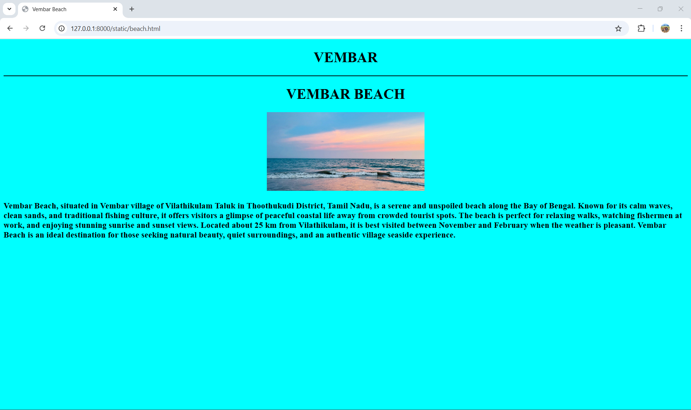
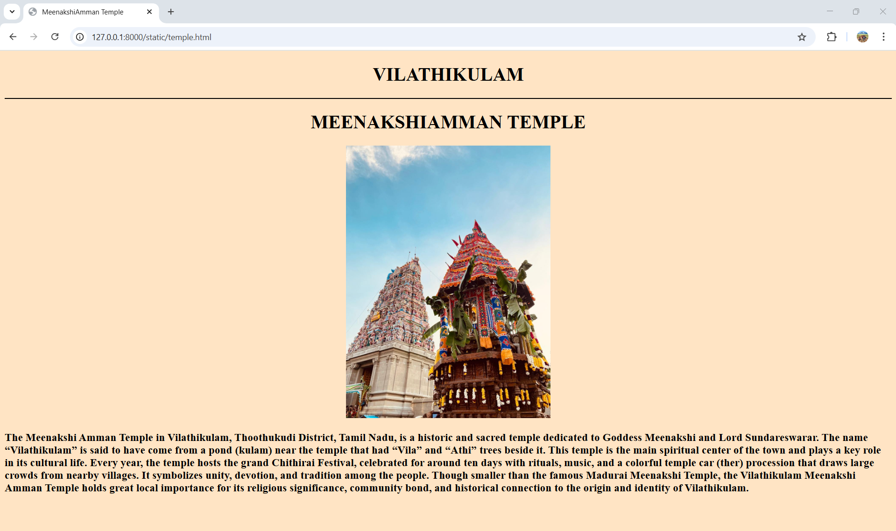

# Ex04 Places Around Me
## Date:28-10-2025

## AIM
To develop a website to display details about the places around my house.

## DESIGN STEPS

### STEP 1
Create a Django admin interface.

### STEP 2
Download your city map from Google.

### STEP 3
Using ```<map>``` tag name the map.

### STEP 4
Create clickable regions in the image using ```<area>``` tag.

### STEP 5
Write HTML programs for all the regions identified.

### STEP 6
Execute the programs and publish them.

## CODE :
```

map.html
```
<!DOCTYPE html>
<html lang="en">
<head>
    <meta charset="UTF-8">
    <meta name="viewport" content="width=device-width, initial-scale=1.0">
    <title>HOME TOWN</title>
    
</head>
<body>
    <h1 align="center">VILATHIKULAM</h1>
        <center>>
        <map name="MyCity">
            <area shape="rect" coords="100,100,500,500" title="MeenakshiAmman Temple" href="temple.html">
            <area shape="rect" coords="693,506,748,474" title="Vembar Beach" href="beach.html">
            <area shape="rect" coords="415,520,377,546" title="Ettyapuram Place" href="place.html">
            <area shape="rect" coords="534,154,582,212" title="Vaippar River" href="river.html">
        </map>
    </center>
    <center><footer><h1>Jeyaarikaran P - 212224240064</h1></footer></center>
</body>
</html>
```

beach.html

```

<!DOCTYPE html>
<html lang="en">
<head>
    <meta charset="UTF-8">
    <meta name="viewport" content="width=device-width, initial-scale=1.0">
    <title>Vembar Beach</title>
</head>
<body style="background-color: aqua;"> 
    <h1 style="text-align: center;">VEMBAR</h1>
    <hr color="black">
    <center><h1>VEMBAR BEACH</h1></center>
    <center></center>
    <h3>Vembar Beach, situated in Vembar village of Vilathikulam Taluk in Thoothukudi District, Tamil Nadu, is a serene and unspoiled beach along the Bay of Bengal. Known for its calm waves, clean sands, and traditional fishing culture, it offers visitors a glimpse of peaceful coastal life away from crowded tourist spots. The beach is perfect for relaxing walks, watching fishermen at work, and enjoying stunning sunrise and sunset views. Located about 25 km from Vilathikulam, it is best visited between November and February when the weather is pleasant. Vembar Beach is an ideal destination for those seeking natural beauty, quiet surroundings, and an authentic village seaside experience. </h3>
    
</body>
</html>
```

river.html :
```

<!DOCTYPE html>
<html lang="en">
<head>
    <meta charset="UTF-8">
    <meta name="viewport" content="width=device-width, initial-scale=1.0">
    <title>Vaippar river</title>
</head>
<body style="background-color: lightpink;">
    <center><h1>VILATHIKULAM</h1></center>
    <hr color="black">
    <center><h1>VAIPPAR RIVER</h1></center>
    <center></center>
    <h3>The Vaippar River flows near Vilathikulam in the Thoothukudi District of Tamil Nadu. It originates from the Varusanadu Hills in the Western Ghats and travels eastward through Virudhunagar and Vilathikulam Taluk before joining the Bay of Bengal near Vembar village.

In the Vilathikulam region, the Vaippar River is an important source of irrigation for nearby villages and farmlands. Although it is a seasonal river that often remains dry during summer, it plays a vital role during the rainy season by supporting agriculture and replenishing local water bodies.

The river also holds cultural and environmental importance, as it connects several rural communities and sustains the natural ecosystem around Vilathikulam.</h3>
</body>
</html>

```
temple.html :
```

<!DOCTYPE html>
<html lang="en">
<head>
    <meta charset="UTF-8">
    <meta name="viewport" content="width=device-width, initial-scale=1.0">
    <title>MeenakshiAmman Temple</title>
</head>
<body style="background-color: bisque;">
    <center><h1>VILATHIKULAM</h1></center>
    <hr color="black">
    <center><h1>MEENAKSHIAMMAN TEMPLE</h1></center>
    <center></center>
    <h3>The Meenakshi Amman Temple in Vilathikulam, Thoothukudi District, Tamil Nadu, is a historic and sacred temple dedicated to Goddess Meenakshi and Lord Sundareswarar. The name “Vilathikulam” is said to have come from a pond (kulam) near the temple that had “Vila” and “Athi” trees beside it. This temple is the main spiritual center of the town and plays a key role in its cultural life.

Every year, the temple hosts the grand Chithirai Festival, celebrated for around ten days with rituals, music, and a colorful temple car (ther) procession that draws large crowds from nearby villages. It symbolizes unity, devotion, and tradition among the people.

Though smaller than the famous Madurai Meenakshi Temple, the Vilathikulam Meenakshi Amman Temple holds great local importance for its religious significance, community bond, and historical connection to the origin and identity of Vilathikulam.</h3>
</body>
</html>

```
place.html :
```
<!DOCTYPE html>
<html lang="en">
<head>
    <meta charset="UTF-8">
    <meta name="viewport" content="width=device-width, initial-scale=1.0">
    <title>Ettyapuram Place</title>
</head>
<body style="background-color: palegreen;">
    <center><h1>VILATHIKULAM</h1></center>
    <hr color="black">
    <center><h1>Ettyapuram Place </h1></center>
    <center></center>
    <h3>The Ettayapuram Palace, also known as Ettappan's Palace, is a significant historical site. Built by the local rulers, the palace showcases colonial architectural influences and offers a glimpse into the region's royal past. While the structure has deteriorated over time, it remains a popular tourist attraction</h3>
</body>
</html>

```


## OUTPUT :

Beach :



Place :


River :


Temple :




## RESULT
The program for implementing image maps using HTML is executed successfully.
